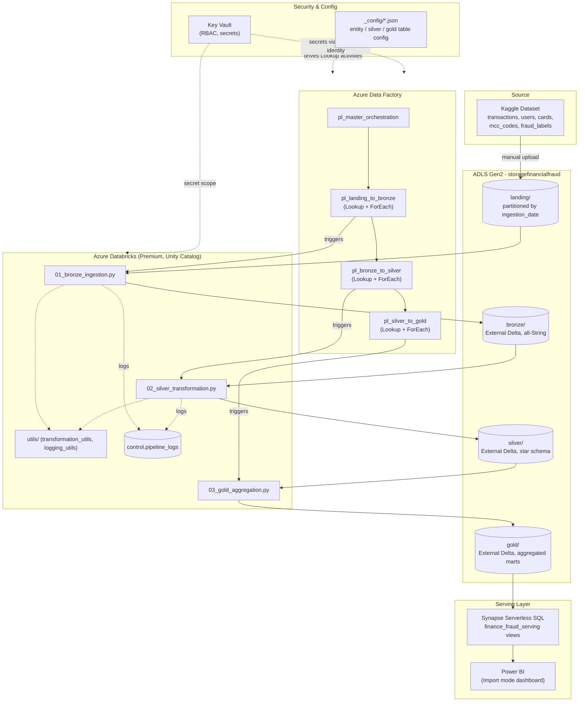

# Architecture Diagram

## Notes on the diagram

- Dotted lines represent configuration/security relationships (secrets,
  logging, config-driven behavior) rather than data flow itself.
- The master orchestrator (`pl_master_orchestration`) calls the three layer
  pipelines in sequence via `Execute Pipeline` activities; each layer
  pipeline is also independently runnable/debuggable on its own.
- Not shown for clarity: the Databricks Access Connector + Unity Catalog
  Storage Credential + External Location chain that authorizes table
  registration, and the AzureDatabricks/ADF/Synapse managed identity role
  assignments on Key Vault and storage — both covered in
  `docs/design_decisions.md`.